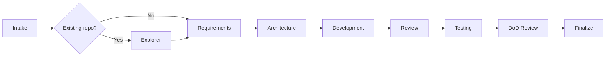
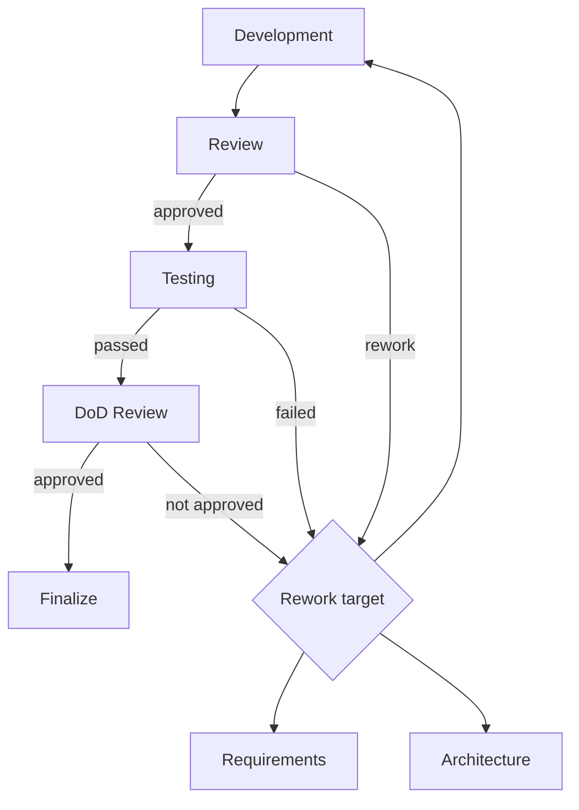
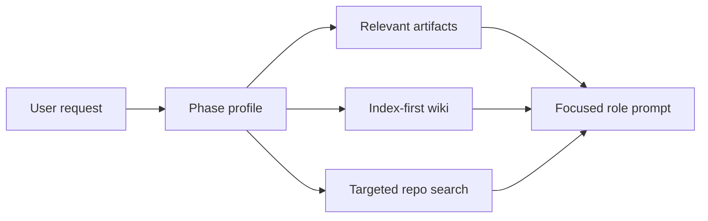
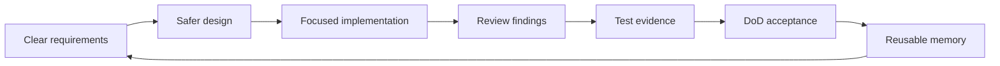

# AI Dev Team Core
## A host-agnostic skeleton for flow-driven software delivery

**Repository:** `ai-dev-team-core`  
**Version:** `1.0.5`

<!--
Speaker notes:
Open by framing this repository as a reusable skeleton, not an application. It is designed to bootstrap projects with a disciplined AI delivery team: clear roles, explicit workflow, artifacts, quality gates, memory, and host adapters. The key idea is that the workflow is portable across AI hosts because the contract lives in repository files, not in one vendor-specific runtime.
-->

---

# The Big Idea

- Turn vague requests into delivered work
- Use specialist AI roles, not one giant prompt
- Preserve decisions in structured artifacts
- Validate every delivery through gates

<!--
Speaker notes:
The skeleton gives AI-assisted delivery a repeatable operating model. Instead of relying on a single assistant to clarify, design, implement, review, and test in one pass, it defines a team process. Each role has a narrow mission, clear write boundaries, and required outputs. This reduces drift, improves accountability, and makes the work easier to audit.
-->

---

# What This Repo Is

- A pristine framework skeleton
- Host-agnostic instructions and contracts
- Native agent profiles where supported
- Python validation harness

<!--
Speaker notes:
The README explicitly says this is a pristine framework skeleton, not an application repository. It contains the reusable framework core and should remain clean. Bootstrapped projects created from it can accumulate project-specific artifacts and memory, but this core repository should preserve reusable contracts and empty placeholders.
-->

---

# What Makes It Valuable

- Clear phase ownership
- Deterministic flow routing
- Built-in quality gates
- Project memory and context policy
- Works with multiple AI hosts

<!--
Speaker notes:
The value is not just in having multiple agent files. The strength is the full operating system around them: an active YAML flow, role contracts, skills, memory rules, artifact schemas, context policies, and test coverage. This creates a reusable delivery discipline for AI work.
-->

---

# Repository Map

- `AGENTS.md`: thin entry point
- `.ai-team/framework/AGENTS.md`: canonical contract
- `.ai-team/flows/software_delivery.yaml`: active flow
- `.github/agents/`: native agent profiles
- `.github/skills/`: reusable procedures

<!--
Speaker notes:
The repository separates the host entry point from the canonical framework. `AGENTS.md` tells compatible hosts where to start. The real rules live under `.ai-team/framework`. The flow is machine-readable YAML. Native profiles adapt the same roles to supported hosts, and skills provide procedural guidance underneath each role.
-->

---

# Canonical Layers

```text
Entry file
  -> Framework contract
    -> Flow definition
      -> Role contracts
        -> Skills
          -> Runtime harness
```

<!--
Speaker notes:
A useful way to explain the architecture is as layers. The entry file launches the process. The framework contract defines the non-negotiable rules. The flow determines phase order. Roles define responsibility and boundaries. Skills define repeatable execution patterns. The runtime harness validates that these contracts work together.
-->

---

# Host-Agnostic by Design

- No provider-specific contract fork
- Native profiles are adapters
- Instruction-compatible hosts still work
- Same flow, roles, prompts, artifacts

<!--
Speaker notes:
The architecture file states that no provider-specific compatibility branch may become a second framework contract. This matters because AI tooling changes quickly. By keeping the canonical model in repository-owned files, the skeleton can support GitHub Copilot native agents, generic instruction-file hosts, or other compatible systems without redefining the process.
-->

---

# The Delivery Flow

```text
Intake -> Exploration? -> Requirements -> Architecture
  -> Development -> Review -> Testing -> DoD -> Finalize
```

<!--
Speaker notes:
The active flow lives in `.ai-team/flows/software_delivery.yaml`. It is not just documentation; the Python harness loads and executes it. The required phases are requirements, architecture, development, review, testing, DoD review, and coordinator finalization. Exploration and support roles are inserted when the state requires them.
-->

---

# Delivery Flow Diagram



<!--
Speaker notes:
This diagram is the happy path. The important point is that the skeleton forces the work through distinct quality-producing stages. Each stage has a different job: understand the need, design safely, implement, review, validate, and accept. The question mark on exploration means repository grounding is used when the request depends on existing code.
-->

---

# Flow as a State Machine

- Steps have explicit `next` routes
- Decisions inspect shared state paths
- Gates route back for rework
- Iteration limits prevent runaway loops

<!--
Speaker notes:
The orchestrator treats the YAML flow as a state machine. Decision nodes inspect paths like `review.approved` or `test_results.passed`. Failed review or test gates route back to developer, architect, or requirements depending on the rework target. The engine also tracks visits, iterations, and max steps to prevent uncontrolled loops.
-->

---

# Gate and Rework Loop



<!--
Speaker notes:
The skeleton improves outcomes because failure is not treated as a vague instruction to “try again.” Each gate identifies the right rework target. Requirement problems go back to requirements, design problems go back to architecture, and implementation defects go back to development. That keeps correction focused and prevents random churn.
-->

---

# Coordinator Role

- Owns intake and routing
- Dispatches specialists and support
- Stays read-only for implementation
- Communicates with the user

<!--
Speaker notes:
The coordinator is deliberately not the implementer. It classifies requests, chooses support, plans development fan-out, and returns final summaries. Repository instructions explicitly prohibit coordinator-side implementation edits. This separation helps avoid the common problem where orchestration and coding blur into one unreviewed pass.
-->

---

# Requirements Engineer

- Clarifies scope and assumptions
- Defines acceptance criteria
- Minimizes blocking questions
- Produces the requirement baseline

<!--
Speaker notes:
The requirements phase converts a user request into something implementable. It identifies in-scope and out-of-scope work, functional requirements, acceptance criteria, constraints, assumptions, and open questions. The role should ask only the minimum clarification questions needed and otherwise proceed with explicit assumptions.
-->

---

# Architect

- Converts requirements into design
- Defines work items and boundaries
- Records technology choices
- Identifies risks and validation needs

<!--
Speaker notes:
The architect owns implementation-safe design. A key rule is that chosen frameworks, SDKs, runtimes, or library versions must remain explicit. The skeleton treats version choices as constraints that flow into development and review, preventing them from disappearing into informal prose.
-->

---

# Developer

- Implements approved design
- Follows clean-code standards
- Adds relevant unit tests
- Runs cheapest meaningful validation

<!--
Speaker notes:
The developer role is constrained by the requirement baseline and design. It must not widen scope. It should run progressive validation: compile, build, typecheck, or equivalent first, then broader checks when justified. Successful command output is summarized rather than copied verbatim.
-->

---

# Reviewer

- Reviews before testing
- Checks correctness and maintainability
- Verifies validation evidence
- Sends structured rework decisions

<!--
Speaker notes:
Review is a required gate before testing. The reviewer is not just looking for style issues. It checks alignment with requirements and design, test quality, validation evidence, version alignment, and clean-code expectations. Review output includes approval, feedback, blocking findings, and a rework target.
-->

---

# Tester

- Validates user-visible outcomes
- Checks edge cases and regressions
- Adds acceptance automation when worthwhile
- Produces structured test results

<!--
Speaker notes:
The tester validates behavior against the requirement baseline and design. Testing is not supposed to be the first place compiler or type errors are discovered; developer-side validation should happen first. The tester focuses on acceptance evidence and clearly states what was and was not verified.
-->

---

# DoD Reviewer

- Final acceptance gate
- Checks functional criteria
- Checks design and non-functional constraints
- Routes missing work to the right role

<!--
Speaker notes:
The Definition of Done reviewer evaluates whether the delivered result is actually acceptable. It uses requirements, design, review findings, and test evidence. It does not rewrite the solution. If something is missing, it identifies whether the issue belongs to requirements, architecture, or development.
-->

---

# Support Roles

- Explorer: repository grounding
- UX/UI Designer: interaction and accessibility support
- Scout: fresh external evidence
- All support is coordinator-mediated

<!--
Speaker notes:
Support roles are reusable but do not call each other directly. The coordinator approves and dispatches support requests. This preserves the flow as the primary abstraction. Explorer is used for repository context, UX/UI for interface-heavy work, and Scout when current external facts could materially change a decision.
-->

---

# Native Agent Profiles

- Stored in `.github/agents/*.agent.md`
- One profile per framework role
- Coordinator is user-invocable
- Specialists are hidden behind handoffs

<!--
Speaker notes:
The native agent profiles are the primary execution surface for GitHub Copilot in VS Code. They mirror the framework roles and use stable tool aliases such as `read`, `edit`, `search`, `execute`, `agent`, and `web`. Only the coordinator is intended to be directly invoked by the user.
-->

---

# Skills Layer

- Stored in `.github/skills/`
- Roles define authority
- Skills define procedures
- Contracts define inputs and outputs

<!--
Speaker notes:
Skills are reusable operational units. For example, the developer uses implementation-clean-code and unit-testing. The reviewer uses code-review. The tester and DoD reviewer use acceptance-testing. Each skill can declare a contract with required inputs, expected outputs, owned artifacts, and completion criteria.
-->

---

# Prompt Bundles

- Shared base prompt
- Coordinator-specific layer
- Specialist base layer
- Support base layer

<!--
Speaker notes:
The runtime team registry defines prompt bundles. This keeps common behavior centralized while allowing role-specific prompt layers. The result is a consistent operating style across roles without copying the entire instruction set into every profile.
-->

---

# Structured Artifacts

- Requirements: `phase_artifacts/requirements/current.yaml`
- Design: `phase_artifacts/design/current.yaml`
- Review: `phase_artifacts/review/current.yaml`
- DoD: `phase_artifacts/dod/current.yaml`

<!--
Speaker notes:
The skeleton standardizes the key delivery artifacts. In this core repository they remain pristine placeholders. In bootstrapped project repositories, the orchestrator can persist active phase artifacts. The artifacts turn a conversation into durable, reviewable project state.
-->

---

# Artifact Lifecycle

```text
Role output
  -> Shared state
    -> YAML artifact
      -> Release docs export
```

<!--
Speaker notes:
The Python `ArtifactSynchronizer` converts state into formal YAML artifacts when artifact persistence is enabled by bootstrap metadata. Release-facing documentation can then be generated from those artifacts, but only in bootstrapped projects and only through the release docs export path.
-->

---

# Memory Model

- Wiki lives under `.ai-team/memory/wiki/`
- Changelog records wiki writes
- Index-first retrieval
- Empty in the reusable skeleton

<!--
Speaker notes:
The framework has a living project wiki concept, but the core skeleton keeps it empty except indexes and schema. Bootstrapped projects can use it to store durable domain terms, architecture decisions, conventions, and incidents. The memory policy avoids dumping everything into context; roles load relevant pages progressively.
-->

---

# Context Optimization

- Policy: `.ai-team/context/policy.yaml`
- Adapters: `.ai-team/context/adapters.yaml`
- Defaults work with no external tools
- Formal artifacts are never compressed

<!--
Speaker notes:
The skeleton is token-aware. It defines output classes, phase profiles, memory retrieval rules, command summary rules, and optional adapters. Optional tools like RTK, Caveman, Headroom, Serena, and memory-index can be detected or enabled, but the framework must still work when none are installed.
-->

---

# Token Usage Model



<!--
Speaker notes:
The token strategy is not “put the whole repo into every prompt.” Each phase has a profile in `.ai-team/context/policy.yaml`. That profile says which artifacts, wiki categories, skills, and output style are relevant. The result is a smaller, more focused context window for each specialist.
-->

---

# Context Loading Strategy

- Load only phase-relevant artifacts
- Read wiki indexes before pages
- Prefer targeted repository search
- Summarize successful commands compactly

<!--
Speaker notes:
This is why token usage is controlled. Requirements do not need the full implementation context. Review does not need every domain wiki page. Successful command logs do not need to be pasted in full. The skeleton defines compact handoffs, index-first memory retrieval, and success-first command summaries so tokens are spent on decision-making rather than noise.
-->

---

# Token Savings in Practice

```text
Broad agent: whole repo + raw logs + repeated context
Skeleton: phase slice + artifacts + targeted memory + concise evidence
```

<!--
Speaker notes:
The skeleton can use more total steps than a single prompt, but each step is more focused. That usually improves useful-token density: fewer irrelevant files, fewer repeated assumptions, fewer giant logs, and less re-explaining. The goal is not always minimum tokens; it is better output per token and fewer expensive rework cycles.
-->

---

# Progressive Validation

- Start with cheapest deterministic check
- Treat successful checks as passed
- Inspect logs mainly on failure
- Record compact evidence

<!--
Speaker notes:
This is one of the more practical engineering rules. The framework encourages compile, build, typecheck, or equivalent validation before review and testing. It also avoids wasting tokens by not reading successful logs in detail unless material warnings appear.
-->

---

# Clean Code Baseline

- Clarity over cleverness
- Small focused units
- Explicit contracts and state
- Testability from the start

<!--
Speaker notes:
The clean-code standard is part of the framework, not an afterthought. It emphasizes separation of concerns, single responsibility, high cohesion, low coupling, intention-revealing names, predictable data flow, and explicit error handling. It also warns against speculative abstractions.
-->

---

# Runtime Harness

- Package under `.ai-team/team_orchestrator/`
- State utilities under `.ai-team/state/`
- Agents under `.ai-team/agents/`
- Tests under `.ai-team/tests/`

<!--
Speaker notes:
The Python harness is described as a validation harness rather than the preferred specialist execution path. It loads the flow, builds the default agent registry, runs state transitions, syncs artifacts and memory, and validates runtime contracts through tests.
-->

---

# CLI Capabilities

- `ai-dev-team-run run`
- `ai-dev-team-run status`
- `ai-dev-team-run context status`
- `ai-dev-team-run context doctor`
- `ai-dev-team-run export-docs`

<!--
Speaker notes:
The CLI makes the framework inspectable and testable outside a native AI host. It can run a simulated flow, inspect persisted state, check context adapter status, validate context configuration, export release docs, invoke repository-tool request construction, and verify version metadata.
-->

---

# Bootstrap Path

- Run `python init.py`
- Validate repository structure
- Install editable package
- Capture project metadata
- Seed bootstrapped artifacts

<!--
Speaker notes:
The `init.py` script checks Python version, validates required paths, verifies version consistency, optionally installs the package, records metadata, and seeds artifacts when blank. This separates the pristine skeleton from a bootstrapped project that is ready to persist artifacts and memory.
-->

---

# Parallel Development

- Coordinator can enable fan-out
- Work items drive parallel developer runs
- Worker outputs are collected
- A developer integrates results

<!--
Speaker notes:
The flow includes `parallel-development` and `integrate-development`. This is useful when a task has separable work items. Even then, integration is explicit, and the result still proceeds through review, testing, and DoD. Parallelism does not bypass quality gates.
-->

---

# Rework Is Designed In

```text
Review failed -> Developer / Architect / Requirements
Testing failed -> Developer / Architect / Requirements
DoD failed -> Developer / Architect / Requirements
```

<!--
Speaker notes:
The gate decisions do not simply say pass or fail. They route to a rework target. If the implementation is wrong, it returns to development. If the design is flawed, it returns to architecture. If the requirement is unclear or incomplete, it returns to requirements. This is important for controlled iteration.
-->

---

# Skeleton Invariants

- Keep core reusable
- Keep wiki empty here
- Keep phase artifacts pristine here
- Do not hand-edit generated release docs
- Keep one canonical contract

<!--
Speaker notes:
The architecture document lists invariants that protect the skeleton. The core repo should not accumulate project-specific state. Generated outputs should not be manually maintained. Provider-specific profiles must remain adapters over the canonical framework, not competing contracts.
-->

---

# Why Output Gets Better

- Less role confusion
- Fewer hidden assumptions
- Earlier defect detection
- More durable context
- Focused prompts per phase

<!--
Speaker notes:
A single broad assistant often mixes product clarification, architecture, coding, testing, and final explanation in one context. That creates role confusion and makes it easy to skip hard checks. This skeleton improves output by forcing the work through focused specialists, explicit artifacts, and gates that catch defects before the final answer.
-->

---

# Failure Modes It Reduces

| Common AI failure | Skeleton mechanism |
|---|---|
| Vague scope | Requirements baseline |
| Overbuilt design | Architect constraints |
| Untested changes | Developer/tester validation |
| Lost decisions | YAML artifacts + wiki |
| Context bloat | Phase profiles |

<!--
Speaker notes:
This table connects the framework directly to output quality. The skeleton does not magically make models smarter. It gives the model a better operating environment: clearer inputs, narrower responsibilities, explicit checkpoints, durable decisions, and controlled context. Those conditions make good output more likely and bad output easier to catch.
-->

---

# Quality Flywheel



<!--
Speaker notes:
The skeleton creates a quality flywheel. Each phase produces evidence that improves the next phase. Over time, project memory and artifacts make future runs better because the agent does not need to rediscover every convention, decision, or constraint from scratch.
-->

---

# What a User Experiences

- Ask the coordinator for work
- Clarification only when needed
- Delivery proceeds autonomously
- Final response summarizes evidence

<!--
Speaker notes:
From the user perspective, the framework should feel simple. The coordinator handles the complexity. The user gives a request, clarifies only blocking ambiguities, and receives a final delivery summary after the flow has gone through the required gates.
-->

---

# What a Project Gains

- Repeatable AI delivery workflow
- Auditable phase outputs
- Reduced prompt drift
- Safer autonomous execution
- Better long-term knowledge reuse

<!--
Speaker notes:
For teams, the skeleton offers repeatability and governance. It reduces hidden assumptions and makes decisions visible. It also gives future agents a project memory system and context loading policy, which helps preserve lessons across runs without flooding every prompt.
-->

---

# Adoption Strategy

1. Keep the skeleton pristine
2. Bootstrap a project repo
3. Use coordinator as the entry point
4. Let artifacts and memory evolve there

<!--
Speaker notes:
The recommended adoption path is to treat this repository as the reusable source. Projects created from it can record project metadata, persist phase artifacts, build wiki knowledge, and generate release docs. The core remains the template and contract source.
-->

---

# Key Takeaway

## This repo is an operating model for AI delivery.

It combines roles, flow, artifacts, memory, context policy, native agents, and validation into one reusable skeleton.

<!--
Speaker notes:
Close by emphasizing that this is more than a collection of prompts. It is a workflow architecture. It defines how AI agents collaborate, what they may edit, how they validate work, how decisions persist, and how the same model can run across different host environments.
-->
